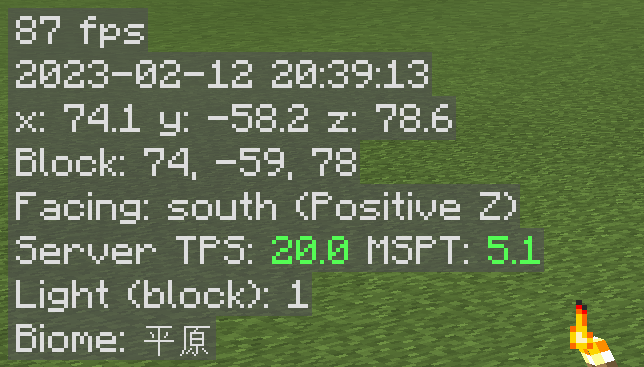

# 🧭 Minihud
> It is recommended to use this mod together with Xaero's minimap.

## 🔗 Mod link
[CurseForge](https://www.curseforge.com/minecraft/mc-mods/minihud)

## 📂 Config file path
`./config`

## 💡 Features
- FPS display
- Real date & time
- Coordinate
- Block coordinate
- Facing
- Server TPS & MSPT
- Light level (block)
- Biome
- `z + c` for free camera
- `z + shift` for fake sneaking
- `l` for overlay light display
- `h + c` for config

## 📸 Screenshots

## 1️⃣ Tested versions
> The following list does not imply that the config files doesn't work for other versions.

- Minecraft 1.18.2, Minihud 0.22.1 Fabric
