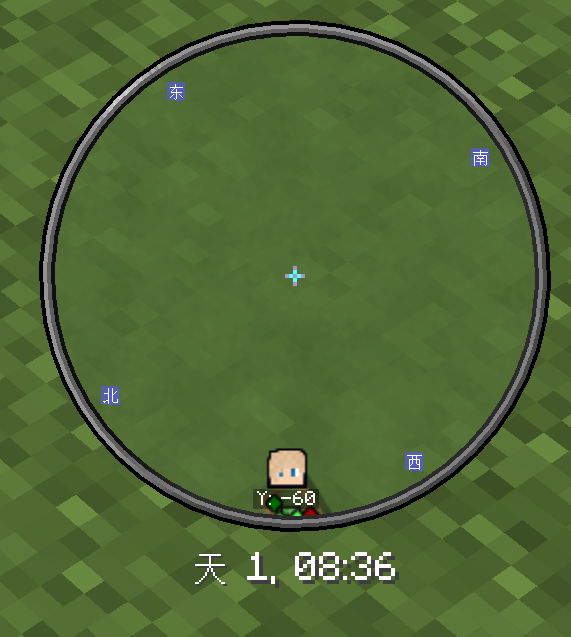
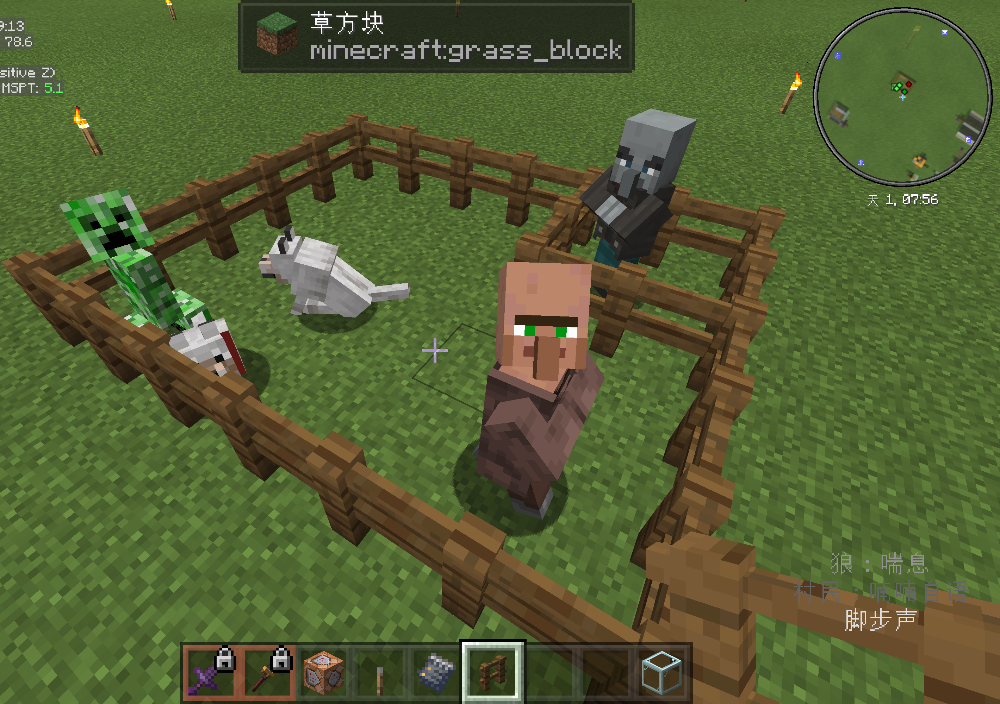

# 🗺️ Xaero's Minimap
## 🔗 Mod link
[CurseForge](https://www.curseforge.com/minecraft/mc-mods/xaeros-minimap)

## 📂 Config file path
`./config`

## 💡 Features
- Always show players, their icons and their Y coordinate. (Screenshot 1)
- Hostile mobs indicated as red dots, and friendly mods indicated as dark green dots. (Screenshot 2)
- Tamed creatures indicated as green dots. (Screenshot 2)
- Items indicated as grey dots.
- Always show creepers as icons (Smaller than players). (Screenshot 2)
- Hide all other entities except for the living and items (So you won't be distracted by paintings or arrows etc.).
- Show current day and time in game. (Screenshot 1&2)
- Show light level. (Not shown on screenshots)
- Semi-transparent.
- Centered when expanded.
- ...

## 📸 Screenshots

## 1️⃣ Tested versions
> The following list does not imply that the config files doesn't work for other versions.

- Minecraft 1.18.2, Xaero's Minimap 22.17.1_Fabric
